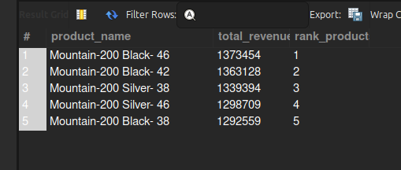
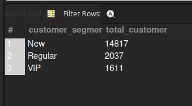
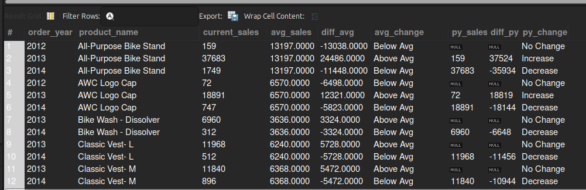
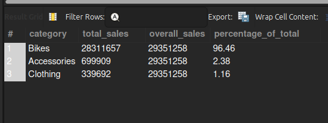
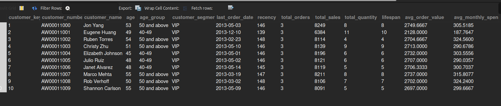

# QueryMetrics: Advanced SQL Analytics Project

## Overview
QueryMetrics is a comprehensive SQL analytics project that models, analyzes, and reports on sales, customer, and product data using a robust MySQL data warehouse. It features advanced SQL techniques—including window functions, CTEs, and dynamic segmentation—to deliver actionable business insights and automated reporting. The project is fully automated for easy setup and reproducibility.

## Features

- **Robust Data Model**: Star schema with fact and dimension tables for scalable analytics.
- **Automated Database Setup**: Scripts to initialize the database and tables.
- **Data Import**: Ready-to-use CSVs for quick population of the database.
- **Modular SQL Scripts**: Each script addresses a specific business question or analysis.
- **Advanced Reporting**: Customer and product reports with dynamic segmentation and KPIs.
- **Comprehensive Analysis**: Covers magnitude, ranking, segmentation, time-series, cumulative, and part-to-whole analyses.

## Skills Demonstrated

### SQL Fundamentals
- Database and table creation
- Data exploration and profiling
- Aggregations, grouping, and filtering

### Advanced SQL Techniques
- **Window Functions**: RANK, DENSE_RANK, ROW_NUMBER, SUM() OVER, AVG() OVER, LAG
- **Common Table Expressions (CTEs)**: Modular, readable queries for complex logic
- **Dynamic Segmentation**: Customer and product segmentation using CASE and business rules
- **KPI Calculation**: Recency, average order value, average monthly spend, and more
- **Time-Series Analysis**: Year-over-year, month-over-month, and cumulative trends
- **Part-to-Whole Analysis**: Category contributions to overall sales
- **Reusable Views**: For customer and product reporting

### Data Modeling & Business Intelligence
- Star schema design (fact and dimension tables)
- Business-focused reporting (VIP customers, high-performing products, etc.)
- Automated and reproducible analytics pipeline

## Project Structure

```
csv-files/      # Source data (customers, products, sales)
backup/         # Logical backup of the database
scripts/        # Modular SQL scripts for setup and analysis
```

## How to Use

### Automated Setup (Recommended)

You can automate the entire process of database creation, table setup, and CSV data import using the provided `setup.sh` script.

1. Make the script executable:
   ```bash
   chmod +x setup.sh
   ```
2. Run the script and follow the prompt for your MySQL root password:
   ```bash
   ./setup.sh
   ```

This will:
- Enable local CSV import on your MySQL server
- Create the database and tables
- Import all data from the CSV files into the correct tables

**setup.sh script content:**
```bash
#!/bin/bash

# Prompt for MySQL root password securely
read -sp "Enter MySQL root password: " MYSQL_PASS
MYSQL_USER="root"
MYSQL_HOST="localhost"
DB_NAME="Querymetrics"

# Enable error handling
set -e

# 0. Enable local_infile on the MySQL server
mysql -u $MYSQL_USER -p$MYSQL_PASS -h $MYSQL_HOST -e "SET GLOBAL local_infile = 1;"
echo "local_infile enabled on MySQL server."

# 1. Create database and tables
mysql --local-infile=1 -u $MYSQL_USER -p$MYSQL_PASS -h $MYSQL_HOST < scripts/00_init_database.sql

echo "Database and tables created."

# 2. Import CSV files into tables
# Import dim_customers
mysql --local-infile=1 -u $MYSQL_USER -p$MYSQL_PASS -h $MYSQL_HOST $DB_NAME -e "
LOAD DATA LOCAL INFILE '$(pwd)/csv-files/dim_customers.csv'
INTO TABLE dim_customers
FIELDS TERMINATED BY ','
ENCLOSED BY '\"'
LINES TERMINATED BY '\n'
IGNORE 1 ROWS;"
echo "dim_customers imported."

# Import dim_products
mysql --local-infile=1 -u $MYSQL_USER -p$MYSQL_PASS -h $MYSQL_HOST $DB_NAME -e "
LOAD DATA LOCAL INFILE '$(pwd)/csv-files/dim_products.csv'
INTO TABLE dim_products
FIELDS TERMINATED BY ','
ENCLOSED BY '\"'
LINES TERMINATED BY '\n'
IGNORE 1 ROWS;"
echo "dim_products imported."

# Import fact_sales
mysql --local-infile=1 -u $MYSQL_USER -p$MYSQL_PASS -h $MYSQL_HOST $DB_NAME -e "
LOAD DATA LOCAL INFILE '$(pwd)/csv-files/fact_sales.csv'
INTO TABLE fact_sales
FIELDS TERMINATED BY ','
ENCLOSED BY '\"'
LINES TERMINATED BY '\n'
IGNORE 1 ROWS;"
echo "fact_sales imported."

echo "All tables populated successfully!"
```

### Manual Setup

1. **Initialize the Database**
   - Run `scripts/00_init_database.sql` to create the schema and tables.

2. **Import Data**
   - Load the CSVs from `csv-files/` into the corresponding tables.

3. **Run Analysis Scripts**
   - Execute scripts in `scripts/` for various analyses and reports.

## Example Analyses

- Top 5 products by revenue
- Customer segmentation (VIP, Regular, New)
- Year-over-year sales trends
- Category-wise sales contribution
- Cumulative and moving average sales

## Sample Outputs

### Top 5 Products by Revenue

```sql
-- Top 5 products generating the highest revenue (from 06_ranking_analysis.sql)
SELECT *
FROM (
    SELECT
        p.product_name,
        SUM(f.sales_amount) AS total_revenue,
        RANK() OVER (ORDER BY SUM(f.sales_amount) DESC) AS rank_products
    FROM fact_sales f
    LEFT JOIN dim_products p
        ON p.product_key = f.product_key
    GROUP BY p.product_name
) AS ranked_products
WHERE rank_products <= 5;
```




### Customer Segmentation (VIP, Regular, New)

```sql
-- Customer segmentation by spending and history (from 10_data_segmentation.sql)
WITH customer_spending AS (
    SELECT
        c.customer_key,
        SUM(f.sales_amount) AS total_spending,
        MIN(order_date) AS first_order,
        MAX(order_date) AS last_order,
        timestampdiff(month, MIN(order_date), MAX(order_date)) AS lifespan
    FROM fact_sales f
    LEFT JOIN dim_customers c
        ON f.customer_key = c.customer_key
    GROUP BY c.customer_key
)
SELECT 
    customer_segment,
    COUNT(customer_key) AS total_customers
FROM (
    SELECT 
        customer_key,
        CASE 
            WHEN lifespan >= 12 AND total_spending > 5000 THEN 'VIP'
            WHEN lifespan >= 12 AND total_spending <= 5000 THEN 'Regular'
            ELSE 'New'
        END AS customer_segment
    FROM customer_spending
) AS segmented_customers
GROUP BY customer_segment
ORDER BY total_customers DESC;
```




### Year-over-Year Sales Trend

```sql
-- Year-over-year sales trend (from 09_performance_analysis.sql)
WITH yearly_product_sales AS (
    SELECT
        YEAR(f.order_date) AS order_year,
        p.product_name,
        SUM(f.sales_amount) AS current_sales
    FROM fact_sales f
    LEFT JOIN dim_products p
        ON f.product_key = p.product_key
    WHERE f.order_date IS NOT NULL
    GROUP BY 
        YEAR(f.order_date),
        p.product_name
)
SELECT
    order_year,
    product_name,
    current_sales,
    AVG(current_sales) OVER (PARTITION BY product_name) AS avg_sales,
    current_sales - AVG(current_sales) OVER (PARTITION BY product_name) AS diff_avg,
    CASE 
        WHEN current_sales - AVG(current_sales) OVER (PARTITION BY product_name) > 0 THEN 'Above Avg'
        WHEN current_sales - AVG(current_sales) OVER (PARTITION BY product_name) < 0 THEN 'Below Avg'
        ELSE 'Avg'
    END AS avg_change,
    -- Year-over-Year Analysis
    LAG(current_sales) OVER (PARTITION BY product_name ORDER BY order_year) AS py_sales,
    current_sales - LAG(current_sales) OVER (PARTITION BY product_name ORDER BY order_year) AS diff_py,
    CASE 
        WHEN current_sales - LAG(current_sales) OVER (PARTITION BY product_name ORDER BY order_year) > 0 THEN 'Increase'
        WHEN current_sales - LAG(current_sales) OVER (PARTITION BY product_name ORDER BY order_year) < 0 THEN 'Decrease'
        ELSE 'No Change'
    END AS py_change
FROM yearly_product_sales
ORDER BY product_name, order_year;

```




### Category Contribution to Total Sales

```sql
-- Category contribution to total sales (from 11_part_to_whole_analysis.sql)
WITH category_sales AS (
    SELECT
        p.category,
        SUM(f.sales_amount) AS total_sales
    FROM dim_products p
     JOIN fact_sales f
        ON p.product_key = f.product_key
    GROUP BY p.category
)
SELECT
    category,
    total_sales,
    SUM(total_sales) OVER () AS overall_sales,
    ROUND((CAST(total_sales AS FLOAT) / SUM(total_sales) OVER()) * 100, 2) AS percentage_of_total
FROM category_sales
ORDER BY total_sales DESC;
```




### Sample Customer Report

```sql
-- Sample customer report (from 12_report_customers.sql)
SELECT * FROM report_customers LIMIT 10;
```




## Technologies

- SQL (MySQL syntax, but adaptable to other RDBMS)
- CSV for data import/export

## License

MIT

---

**This project demonstrates my ability to design, implement, and analyze data using advanced SQL techniques, making it ideal for roles in data engineering, analytics, and business intelligence.**
